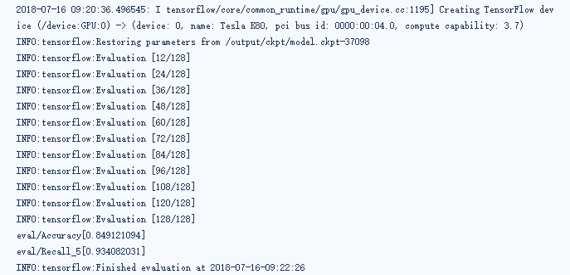
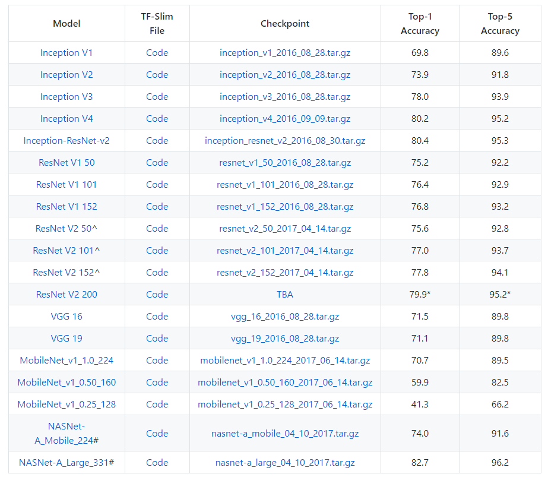
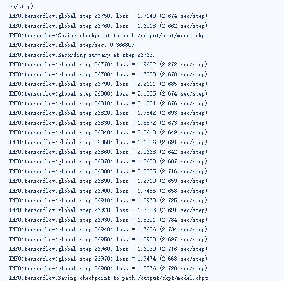

# vehicleClaasifaction
车辆分类的tensorflow代码

This is API for training a deep neural network that apply to classify vehicle. There are about 50000 vehicle pictures for training and evaluating, which all of them comes from Internet. We make label and put them in our Inveption_v4 model to train, after 24 hours training on 1080ti GPU, we get a model that accuracy reachs to 85 percents and recall reachs to 93percents



## make tfrecord file
all training datasets and evaluating datasets need to be switched to tfrecord file, `download_and_convert_data.py` provide us a method to make tfrecord file, but our datasets is not recognized on this file, we must modify codes and create a file named `pj_vehicle.py` on path `./datasets`. After finishing recognizing, we run the following command:

``` bash
python download_and_convert_data.py --dataset_name=pj_vehicle \
```

## Pre-trained Models
Choosing a suitable pre-trained model is effective to help our network convergence quickly, according offical API, we choose inception_v4 pre-trained model on the `ILSVRC-2012-CLS` image classification dataset, which has 80% top1 accuracy and 95% top5 accuracy:



## starting training and evaluating
Execute the following command to start training and evaluating:

``` bash
python train_eval_image_classifier.py 
--learning_rate=0.001 \
--batch_size=32 \
--output_dir=/output \
--dataset_name=pj_vehicle \
--dataset_dir=/data \
--model_name=inception_v4 \
--train_dir=/output/ckpt \
--optimizer=rmsprop \
--dataset_split_name=validation \
--eval_dir=/output/eval \
--max_num_batches=128 \
--dataset_dir_validation=/data \
--checkpoint_path=/data/model.ckpt-$current \
```

Then, log prints:


## Exporting the Inference Graph
Saves out a GraphDef containing the architecture of the model.
To use it with a model name defined by slim, run:

``` bash
python export_inference_graph.py \
--alsologtostderr \
--model_name=inception_v4 \
--output_file=./my_inception_v4.pb \
--dataset_name=pj_vehicle
```

## Freezing the exported Graph
If you then want to use the resulting model with your own or pretrained checkpoints as part of a mobile model, you can run freeze_graph to get a graph def with the variables inlined as constants using:

``` bash
python freeze_graph.py \
--input_graph=my_inception_v4.pb \
--input_checkpoint=./datasets/model.ckpt-13740 \
--output_graph=./my_inception_v4_freeze.pb \
--input_binary=True \
--output_node_name=prediction
```
